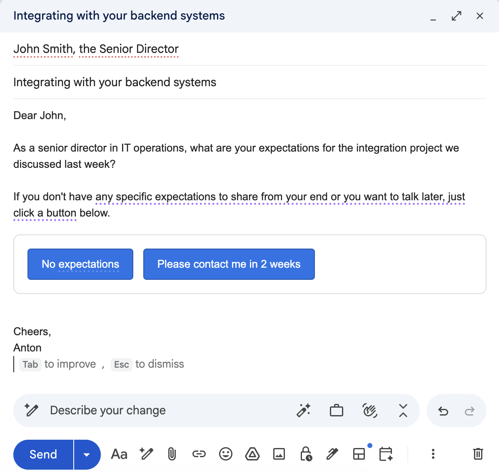

# One-click response for Gmail

One-click response (hereinafter - 1CR) for Gmail is a tool that adds one or several quick personalized response hyperlinks that allow the email recipient to simply click one of the buttons instead of writing their own response to the email.

The intended use is to elicit responses from very busy stakeholders who are unlikely to otherwise respond to an email. The recipient can quickly respond in all kinds of busy situations, for example on the go or during a short break between meetings.

The full product specifications are in [the specs folder](./docs/specs/).

Installation and deployment: [docs/installing](./docs/installing/INSTALL.md). Local development: [docs/development](./docs/development/CONTRIBUTING.md).

The license is [in the LICENSE file](./LICENSE).
