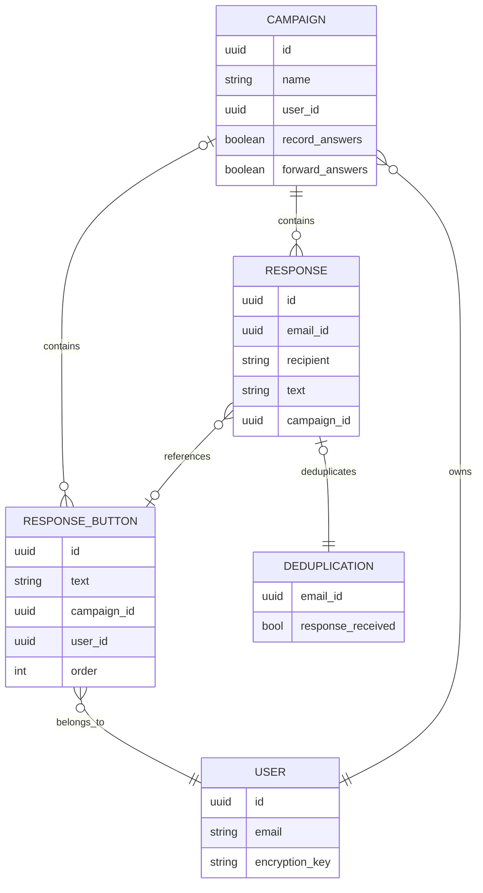

# 1CR data structure

1CR uses the following domain model.

## Campaign

Campaign is a named entity that belongs to a certain user and groups responses on the same topic.

Examples of Campaigns: "Anna's birthday attendance", "Acme systems NPS".

Properties of a Campaign:

- Name
- Owner (user reference)
- Record answers (boolean, determines whether the submitted answers are collected in the database)
- Forward answers (boolean, determines whether the submitted answers are forwarded to the owner)

## Response button

A Response button is a projected answer. A Response button can either belong to a Campaign or be a loose response that is just determined for an individual email.

Properties of a Response button:

- Text
- Campaign (campaign reference, optional)
- Owner (user reference, optional)
- Order (buttons are sorted in ascending order by this field)

One and only one of the two - Campaign or Owner must be specified.

If the Response button does not belong to a Campaign, its response is never recorded and always forwarded to the owner.

## Response

A Response is a recorded response that is created when the recipient clicks the button corresponding to one of the Response buttons choices.

Properties of a Response:

- Text (the same as the corresponding Response button's)
- Recipient (the recipient or concatenated string of all recipients of the email that triggered the response)
- Subject (the subject of the email)
- Campaign

## Deduplication

A record that confirms whether an answer on a particular email has been registered. The `email_id` is the identifier of the email as defined by [the Add Response Buttons logic](./gmail-addon/add-button-block.md).

The deduplication record is anonymized is a sense that it does not track recipients or the answers - only the fact that the response has been given.

No record, or a record with the `false` value in `response_received` means that there has been no response yet, and thus no duplication.
A record with the `true` value in `response_received` means that the response has already been received and further responses on that `email_id` should not be accepted.

## User

A User is a representation of the user of the system.

## Class diagram

