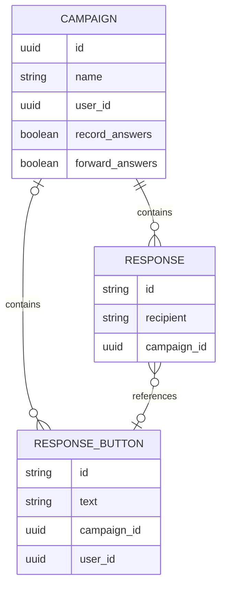

# 1CR data structure

1CR uses the following domain model.

## Campaign

Campaign is a named entity that belongs to a certain user and groups responses on the same topic.

Examples of Campaigns: "Anna's birthday attendance", "Acme systems NPS".

Properties of a Campaign:

- Name
- Owner (user reference)
- Record answers (boolean, determines whether the submitted answers are collected in the database)
- Forward answers (boolean, determines whether the submitted answers are forwarded to the owner)

## Response button

A Response button is a projected answer. A Response button can either belong to a Campaign or be a loose response that is just determined for an individual email.

Properties of a Response button:

- Text
- Campaign (campaign reference, optional)
- Owner (user reference, optional)

One and only one of the two - Campaign or Owner must be specified.

If the Reponse button does not belong to a Campaign, its response is never recorded and always forwarded to the owner.

## Response

A Response is a recorded response that is created when the recipient clicks the button corresponding to one of the Response buttons choices.

Properties of a Response:

- Text (the same as the corresponding Response button's)
- Recipient (the recipient or recipients of the email that triggered the response)
- Campaign

## Class diagram

